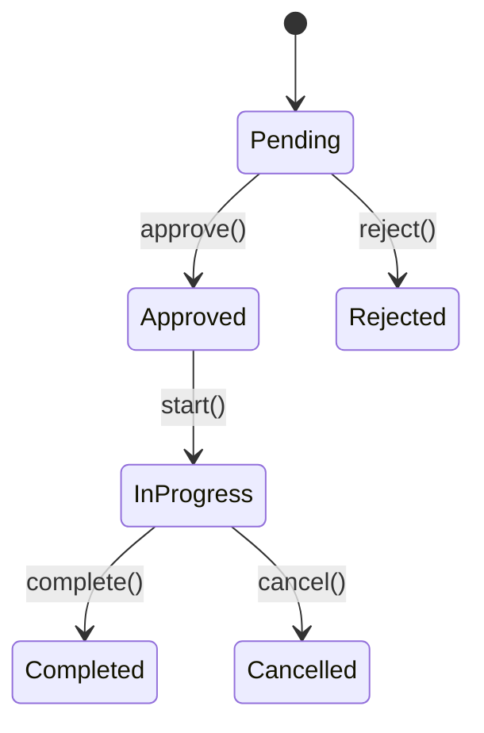
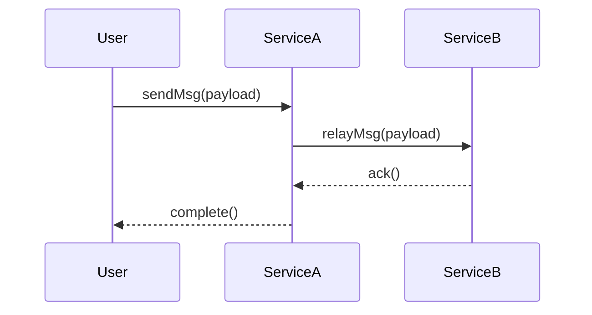

# Advanced Quint: Refinement, Liveness, and Code Generation

This guide covers advanced techniques to leverage Quint's full power for complex systems, ensuring not just safety, but also architectural integrity and liveness.

For syntax-validated runnable counterparts, use `EXECUTABLE-EXAMPLES.md`.

---

## 1. Refinement Modeling (Abstract -> Concrete)

Refinement is the process of proving that a detailed **Concrete Model** (with implementation details like gas, buffers, or specific data structures) correctly implements a high-level **Abstract Model**.

### The Refinement Pattern

1. **Abstract Module**: Define the high-level business logic (e.g., a simple `Transfer` action).
2. **Concrete Module**: Define the low-level logic (e.g., a `Transfer` that includes a `Pending` state and a `Relayer`).
3. **Refinement Mapping**: Define a mapping from concrete state variables to abstract state variables.
4. **Proof**: Use Quint to prove that every step in the Concrete model corresponds to a valid step (or a stutter/no-op) in the Abstract model.

```text
// Abstract Model: simple atomic balance transfer
module AbstractBank {
  const USERS: Set[str]
  var balances: str -> int

  pure def getBalance(addr: str): int =
    if (balances.contains(addr)) balances.get(addr) else 0

  val balancesNonNegative = USERS.forall(u => getBalance(u) >= 0)

  action transfer(from: str, to: str, amount: int): bool = all {
    amount > 0,
    getBalance(from) >= amount,
    balances' = balances
      .setBy(from, b => b - amount)
      .setBy(to, b => b + amount),
  }
}

// Concrete Model: two-phase transfer — escrow then release
module ConcreteBank {
  const USERS: Set[str]
  type Transfer = { from: str, to: str, amount: int }

  var vault: str -> int        // Confirmed balances
  var pending: Set[Transfer]   // In-flight transfers (funds already deducted from vault)

  pure def vaultOf(addr: str): int =
    if (vault.contains(addr)) vault.get(addr) else 0

  // Refinement mapping: abstract balance = vault minus outgoing in-flight escrow
  pure def abstractBalance(addr: str): int =
    val outgoing = pending.filter(t => t.from == addr)
    val escrowed = outgoing.fold(0, (sum, t) => sum + t.amount)
    vaultOf(addr) - escrowed

  // Refinement invariant: the mapped concrete state satisfies the abstract safety property
  val refinementCorrect = USERS.forall(u => abstractBalance(u) >= 0)
}
```

---

## 2. Liveness & Fairness (Temporal Logic)

While **Safety** proves "nothing bad happens," **Liveness** proves "something good _eventually_ happens."

### Fairness Constraints

To prove liveness, you often need to assume **Fairness**: that if an action is enabled, it will eventually be taken.

- **Weak Fairness** (`weakFair(A, e)`): If action `A` is _continuously_ enabled (on variable expression `e`), it must eventually occur.
- **Strong Fairness** (`strongFair(A, e)`): If action `A` is _infinitely often_ enabled, it must eventually occur.

```text
temporal fairStep = weakFair(step, x)
```

### Temporal Properties

Use `temporal`, `always`, `eventually`, and `leadsTo` (v0.32.0) to define liveness:

```text
// Leads-to: whenever a Pending intent exists, it eventually resolves
temporal intentsResolve =
  always(
    intents.keys().forall(id =>
      status.get(id) == Pending implies
      eventually(status.get(id) == Settled or status.get(id) == Expired)
    )
  )

// leadsTo shorthand for the above pattern (v0.32.0):
temporal intentsResolveShort =
  intents.keys().forall(id =>
    (status.get(id) == Pending).leadsTo(
      status.get(id) == Settled or status.get(id) == Expired
    )
  )

// Deadlock freedom: the step action always has at least one enabled branch
// (verified implicitly: if quint run never gets stuck, the model is deadlock-free)
// Explicitly, ensure step covers all possible states with a stutter branch.
```

**Verify temporal properties:**

```bash
quint verify --temporal=intentsResolve --max-steps=20 spec.qnt
```

---

## 3. Spec-to-Boilerplate Generation (Forward Engineering)

Once a Quint specification is verified, use it to generate the **Interface** or **Skeleton** of the implementation.

### Generation Strategy

1. **Types to Structs**: Convert Quint `type` records and sum types to Solidity `struct`/`enum`, Rust `struct`/`enum`, or Go `type`.
2. **Actions to Functions**: Convert Quint `action` definitions to function signatures with appropriate `require` statements derived from Quint guards.

**Example: Quint to Solidity**

```text
// Quint Action
action deposit(sender: Address, amount: int): bool = all {
  amount > 0,
  balances' = balances.setBy(sender, b => b + amount),
}
```

**Generated Solidity Skeleton:**

```solidity
function deposit(uint256 amount) public {
    require(amount > 0, "Guard violation: amount > 0");
    // TODO: balances[msg.sender] += amount;
}
```

---

## 4. Specification Visualization (Architecture Diagrams)

Formal specifications can be difficult for non-experts to read. Automatically generate **Mermaid.js** diagrams to visualize the system's architecture and state transitions.

### State Transition Diagrams

Map Quint `Status` sum types to states and `action` names to transitions.



### Sequence Diagrams

Model multi-component message passing from `SYSTEM-ARCH-TEMPLATE.md`.


