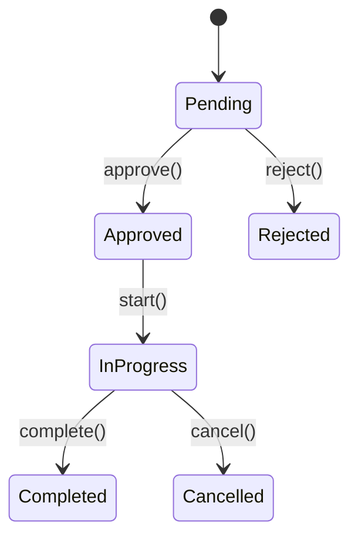
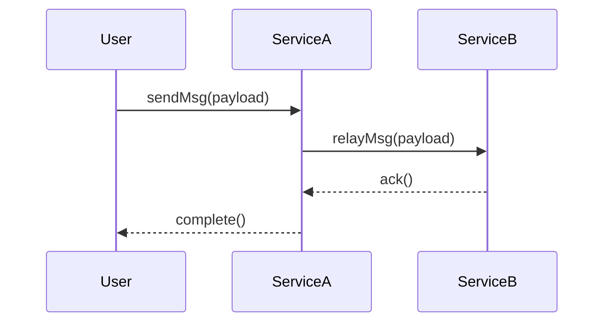

# Advanced Quint: Refinement, Liveness, and Code Generation

This guide covers advanced techniques to leverage Quint's full power for complex systems, ensuring not just safety, but also architectural integrity and liveness.

For syntax-validated runnable counterparts, use `EXECUTABLE-EXAMPLES.md`.

---

## 1. Refinement Modeling (Abstract -> Concrete)

Refinement is the process of proving that a detailed **Concrete Model** (with implementation details like gas, buffers, or specific data structures) correctly implements a high-level **Abstract Model**.

### The Refinement Pattern

1. **Abstract Module**: Define the high-level business logic (e.g., a simple `Transfer` action).
2. **Concrete Module**: Define the low-level logic (e.g., a `Transfer` that includes a `Pending` state and a `Relayer`).
3. **Refinement Mapping**: Define a mapping from concrete state variables to abstract state variables.
4. **Check**: Establish that the mapped concrete state satisfies the abstract
   safety property, and that each concrete step moves the mapped state the way an
   abstract step (or a stutter) would.

> **What the example below does and does not establish.** A _refinement invariant_
> (`refinementSafety`) shows the mapped state is always abstractly valid. That is
> strictly weaker than _step refinement_, which additionally requires every concrete
> step to correspond to an abstract step or a stutter. Step correspondence needs the
> mapped value **before and after** the transition, so it requires a ghost variable —
> shown as `stepRefines` below. Do not describe a passing `refinementSafety` as a
> refinement proof.

```quint illustrative
// Abstract Model: simple atomic balance transfer
module AbstractBank {
  const USERS: Set[str]
  var balances: str -> int

  // `def`, not `pure def`: it reads the state variable `balances`.
  // `pure def` that touches a var is a hard error (QNT200).
  def getBalance(addr: str): int =
    if (balances.keys().contains(addr)) balances.get(addr) else 0

  val balancesNonNegative = USERS.forall(u => getBalance(u) >= 0)

  // NOT `to`: `to` is the built-in range operator (`1.to(5)`), and using it as a
  // parameter name is a hard parse error (QNT101).
  action transfer(src: str, dst: str, amount: int): bool = all {
    amount > 0,
    getBalance(src) >= amount,
    // `put`, not `setBy`: setBy fails at runtime on a key that is absent (QNT507).
    balances' = balances
      .put(src, getBalance(src) - amount)
      .put(dst, getBalance(dst) + amount),
  }
}

// Concrete Model: two-phase transfer -- escrow then release
module ConcreteBank {
  const USERS: Set[str]
  type Transfer = { from: str, to: str, amount: int }

  var vault: str -> int        // Confirmed balances (escrow already deducted)
  var pending: Set[Transfer]   // In-flight transfers (funds already left the vault)
  var prevAbstract: str -> int // Ghost: mapped state as of the previous step

  def vaultOf(addr: str): int =
    if (vault.keys().contains(addr)) vault.get(addr) else 0

  // Refinement mapping. Abstractly the transfer is atomic: it has either happened
  // or it has not. While a transfer is in flight it has NOT happened, so the funds
  // must still be attributed to the SENDER -- and `vault` has already deducted
  // them, so they are ADDED BACK here.
  //
  // Writing `vaultOf(addr) - escrowed` (the intuitive-looking form) deducts the
  // same amount twice: total mapped supply silently drops by the in-flight amount,
  // and any conservation invariant over the mapped state becomes unsatisfiable.
  def abstractBalance(addr: str): int =
    val outgoing = pending.filter(t => t.from == addr)
    val escrowed = outgoing.fold(0, (sum, t) => sum + t.amount)
    vaultOf(addr) + escrowed

  def abstractState: str -> int = USERS.mapBy(u => abstractBalance(u))

  // (a) Refinement invariant: mapped state satisfies the abstract safety property.
  val refinementSafety = USERS.forall(u => abstractBalance(u) >= 0)

  // (b) Step correspondence: each concrete step either leaves the mapped state
  // unchanged (a stutter) or changes it while conserving total supply, as an
  // abstract `transfer` would. With the mapping above it is ESCROWING that
  // stutters -- the funds stay attributed to the sender -- and RELEASING that
  // performs the abstract transfer.
  val stepRefines =
    val before = USERS.fold(0, (s, u) => s + prevAbstract.get(u))
    val after = USERS.fold(0, (s, u) => s + abstractBalance(u))
    prevAbstract == abstractState or before == after
}
```

Check both with `quint verify --invariant=refinementSafety,stepRefines`. `stepRefines`
is only meaningful once `prevAbstract' = abstractState` is threaded through every
action in the concrete `step`.

---

## 2. Liveness & Fairness (Temporal Logic)

While **Safety** proves "nothing bad happens," **Liveness** proves "something good _eventually_ happens."

### Fairness Constraints

To prove liveness, you often need to assume **Fairness**: that if an action is enabled, it will eventually be taken.

- **Weak Fairness** (`weakFair(A, vars)`): If action `A` is _continuously_ enabled, it must eventually occur.
- **Strong Fairness** (`strongFair(A, vars)`): If action `A` is _infinitely often_ enabled, it must eventually occur.

> **The second argument must be a SET of state variables, not a bare variable.**
> Both operators are defined in terms of `mustChange(a, v)`, which calls `v.map(...)`,
> so `v` has to be a set. The declared signature is `(bool, a) => bool` with an
> unconstrained type variable, which means **`weakFair(step, x)` typechecks with no
> error and no warning** while being meaningless. This is a silent failure: nothing
> in the toolchain will tell you the fairness assumption is malformed.

<!-- quint-preamble
var balances: int
var totalSupply: int
action step = all { balances' = balances, totalSupply' = totalSupply }
-->

```quint illustrative
// CORRECT -- a set of every variable the action may change
temporal fairStep = weakFair(step, Set(balances, totalSupply))

// WRONG -- typechecks silently, means nothing:
//   temporal fairStep = weakFair(step, balances)
```

A fairness constraint is only useful as an antecedent. State it as
`fairness.implies(property)`, never as a standalone `temporal`:

<!-- quint-preamble
var balances: int
var totalSupply: int
action step = all { balances' = balances, totalSupply' = totalSupply }
val allSettled = balances == 0
-->

```quint illustrative
temporal fairness = weakFair(step, Set(balances, totalSupply))
temporal eventuallySettles = fairness.implies(eventually(allSettled))
```

### Temporal Properties

Use `temporal`, `always`, `eventually`, and `leadsTo` (v0.32.0) to define liveness:

<!-- quint-preamble
type Status = Pending | Settled | Expired
var intents: int -> str
var status: int -> Status
-->

```quint illustrative
// Leads-to: whenever a Pending intent exists, it eventually resolves
temporal intentsResolve =
  always(
    intents.keys().forall(id =>
      status.get(id) == Pending implies
      eventually(status.get(id) == Settled or status.get(id) == Expired)
    )
  )

// leadsTo shorthand for the above pattern (v0.32.0):
temporal intentsResolveShort =
  intents.keys().forall(id =>
    (status.get(id) == Pending).leadsTo(
      status.get(id) == Settled or status.get(id) == Expired
    )
  )

// Deadlock freedom: simulation (quint run) not getting stuck is a heuristic only --
// it does NOT prove deadlock freedom; unexplored paths may still be stuck.
// For a formal check use an explicit enabledness invariant:
//   val notDeadlocked = enabled(step)
// `enabled` is NOT supported by the simulator: `quint run` fails with QNT501.
// It is only usable under `quint verify` (Apalache/TLC).
// or run exhaustive finite-state checking with TLC.
// Always add a stutter branch (all { var1' = var1, ... }) so the model never
// gets stuck when no meaningful action applies.
```

**Verify temporal properties:**

```bash
quint verify --backend=tlc --temporal=intentsResolve --max-steps=20 spec.qnt
```

---

## 3. Spec-to-Boilerplate Generation (Forward Engineering)

Once a Quint specification is verified, use it to generate the **Interface** or **Skeleton** of the implementation.

> **Warning:** Generated code is a starting point, not a verified implementation.
> The Quint spec models an abstraction; the generated skeleton must be independently
> reviewed, audited, and tested. Guards in generated `require` statements correspond
> to Quint guards but do not account for gas, reentrancy, integer overflow (`int` →
> `uint256`), or any behavior omitted from the model.

### Generation Strategy

1. **Types to Structs**: Convert Quint `type` records and sum types to Solidity `struct`/`enum`, Rust `struct`/`enum`, or Go `type`.
2. **Actions to Functions**: Convert Quint `action` definitions to function signatures with appropriate `require` statements derived from Quint guards.

**Example: Quint to Solidity**

<!-- quint-preamble
type Address = str
var balances: Address -> int
def balanceOf(a: Address): int =
  if (balances.keys().contains(a)) balances.get(a) else 0
-->

```quint illustrative
// Quint Action
action deposit(sender: Address, amount: int): bool = all {
  amount > 0,
  // `put`, not `setBy`: setBy raises QNT507 on a first-time depositor.
  balances' = balances.put(sender, balanceOf(sender) + amount),
}
```

**Generated Solidity Skeleton:**

```solidity
function deposit(uint256 amount) public {
    require(amount > 0, "Guard violation: amount > 0");
    // TODO: balances[msg.sender] += amount;
}
```

---

## 4. Specification Visualization (Architecture Diagrams)

Formal specifications can be difficult for non-experts to read. Automatically generate **Mermaid.js** diagrams to visualize the system's architecture and state transitions.

### State Transition Diagrams

Map Quint `Status` sum types to states and `action` names to transitions.


```mermaid
stateDiagram-v2
    [*] --> Pending
    Pending --> Approved: approve()
    Pending --> Rejected: reject()
    Approved --> InProgress: start()
    InProgress --> Completed: complete()
    InProgress --> Cancelled: cancel()
```

### Sequence Diagrams

Model multi-component message passing from `SYSTEM-ARCH-TEMPLATE.md`.


```mermaid
sequenceDiagram
    participant User
    participant ServiceA
    participant ServiceB
    User->>ServiceA: sendMsg(payload)
    ServiceA->>ServiceB: relayMsg(payload)
    ServiceB-->>ServiceA: ack()
    ServiceA-->>User: complete()
```
